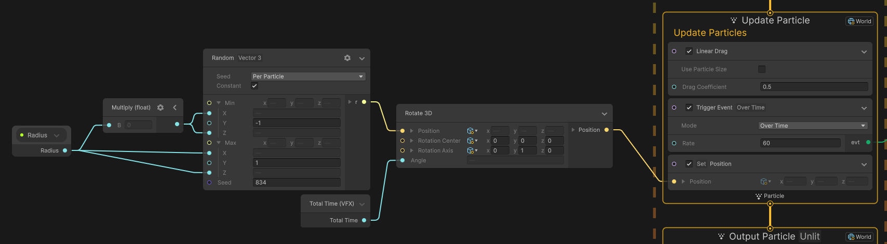

# URP | Antwoorden

## Licht Aanzetten

-	De juiste light type voor de torch is de point light. Point light geeft licht aan alle kanten vanuit de torch.
  

-	De juiste light type voor de fontein is de spot light. Spot light zorgt ervoor dat alleen de fontein licht ontvangt.
  

## Een Goede Framerate
-	Om het gameobject te vinden moet je elk gameobject in de hyrarchy uitzetten via de inspector totdat de lag afneemt. Als het goed is zal je in de profiler kunnen zien wanneer de lag dramatisch afneemt. 
-	Het gameobject wat voor deze lag zorgt is de particle generator verstopt in: Cave_Toadstools>Toadstools2>Toadstools1>Strange_Mushroom. 

## Shader Graph | Water

## VFX
1. Om de kleur te veranderen naar geel moet de "set color" blok aangepast worden alsvolgt:

2. Om de feeën te laten vliegen rond de fontein te vliegen moet de VFX graph er alsvolgd uitzien:

De "set position shape" blok moet verwijderd worden 
## Global Effects
